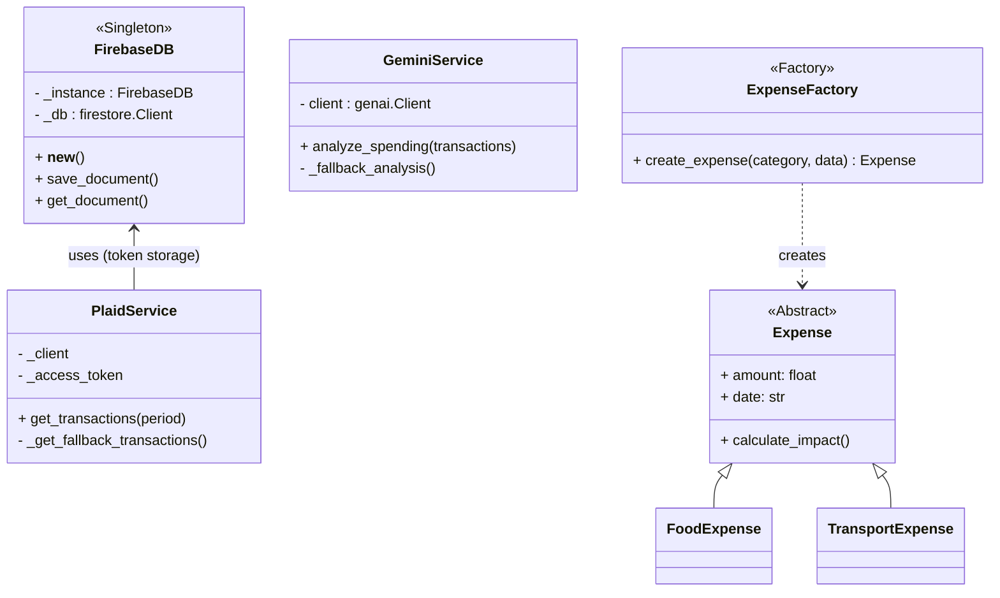
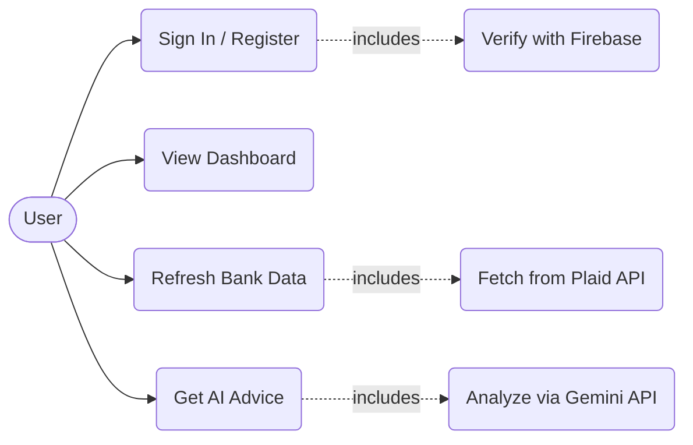
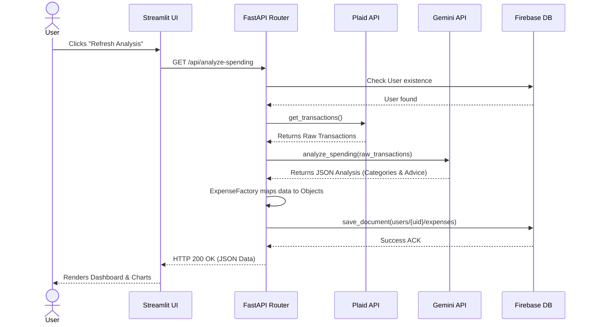
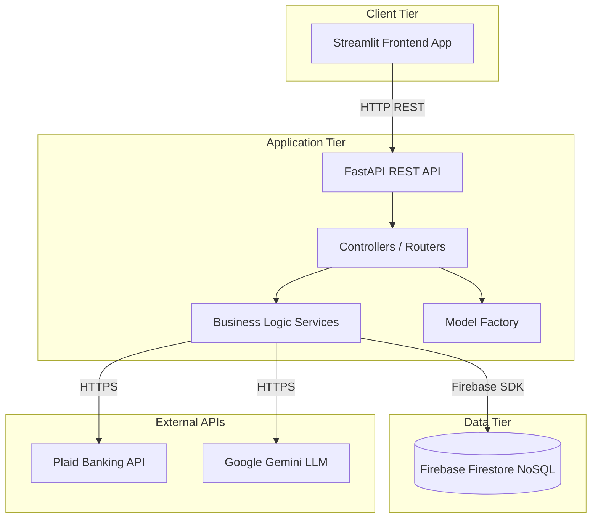
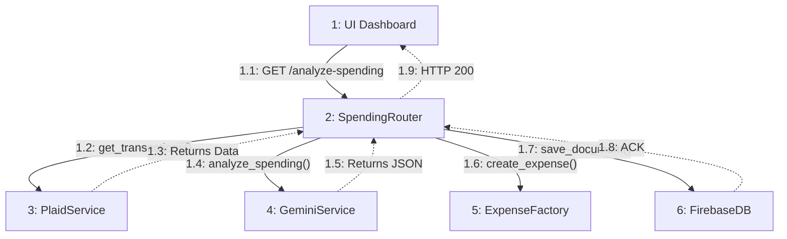
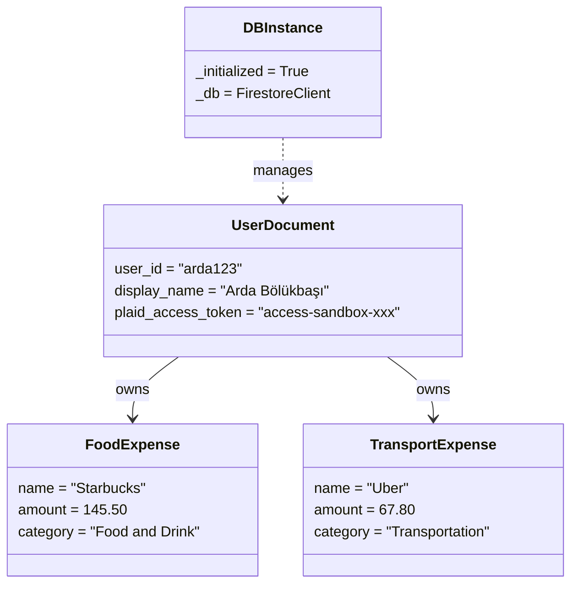
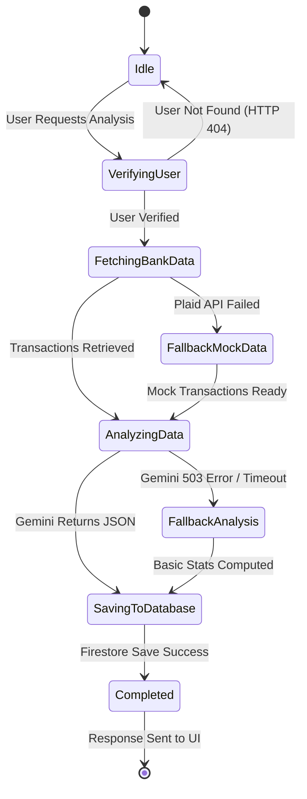

# 🏦 BudgerAI — Backend API

Yapay zeka destekli kişisel finans analiz platformu. Banka harcamalarını otomatik kategorize eder, istatistik hesaplar ve kişiselleştirilmiş Türkçe finansal tavsiye üretir.

> **Not:** Bu proje yalnızca Backend (REST API) katmanını içerir. Frontend ekibi ayrı çalışmaktadır.

---

## 🛠️ Teknoloji Yığını

| Katman | Teknoloji | Açıklama |
|--------|-----------|----------|
| **Framework** | FastAPI (Python) | Yüksek performanslı async REST API |
| **Veritabanı** | Firebase Firestore | NoSQL bulut veritabanı |
| **Banka API** | Plaid Sandbox | Test ortamında sahte banka verisi |
| **Yapay Zeka** | Google Gemini API | Doğal dil işleme ve harcama analizi |
| **Tasarım Kalıpları** | Singleton + Factory | Akademik rapor gereksinimleri |

---

## 🎯 Tasarım Kalıpları (Design Patterns)

### 🔷 Singleton Pattern — `FirebaseDB`
> **Dosya:** [`database/firebase_client.py`](database/firebase_client.py)

Firebase veritabanı bağlantısı Singleton Pattern ile yönetilir. Uygulama boyunca yalnızca **tek bir bağlantı nesnesi** oluşturulur.

```python
db1 = FirebaseDB()
db2 = FirebaseDB()
print(db1 is db2)  # → True (aynı instance)
```

**Neden Singleton?**
- Firebase bağlantısı pahalı bir kaynaktır (ağ, kimlik doğrulama)
- Her istekte yeni bağlantı açmak kaynak israfıdır
- Thread-safe double-checked locking ile güvenli erişim

### 🔷 Factory Pattern — `ExpenseFactory`
> **Dosya:** [`models/expense.py`](models/expense.py)

Gemini AI'dan gelen kategori bilgisine göre doğru `Expense` alt sınıfı otomatik üretilir.

```python
expense = ExpenseFactory.create("Yeme & İçme", "Starbucks", 145.50, "2026-05-01")
# → FoodExpense(merchant_name="Starbucks", amount=145.50, ...)
```

**Desteklenen Kategoriler:**

| Sınıf | Kategori | İkon |
|-------|----------|------|
| `FoodExpense` | Yeme & İçme | 🍔 |
| `TransportExpense` | Ulaşım | 🚗 |
| `BillExpense` | Fatura | 📄 |
| `ShoppingExpense` | Alışveriş | 🛒 |
| `EntertainmentExpense` | Eğlence | 🎬 |
| `HealthExpense` | Sağlık | 💊 |
| `OtherExpense` | Diğer | 📦 |

---

## 📁 Proje Yapısı

```
.
├── main.py                        # FastAPI uygulama giriş noktası
├── config.py                      # Ortam değişkenleri (Settings)
├── requirements.txt               # Python bağımlılıkları
├── .env.example                   # API anahtarları şablonu
├── test_pipeline.py               # Uçtan uca test scripti
│
├── database/
│   ├── __init__.py
│   └── firebase_client.py         # 🔷 Singleton Pattern
│
├── models/
│   ├── __init__.py
│   └── expense.py                 # 🔷 Factory Pattern
│
├── services/
│   ├── __init__.py
│   ├── plaid_service.py           # Plaid Sandbox + Mock Data
│   └── gemini_service.py          # Gemini AI analiz servisi
│
└── routers/
    ├── __init__.py
    ├── spending.py                # /api/analyze-spending
    └── user.py                    # /api/register-user
```

---

## 🔄 Sistem Akışı (Data Pipeline)

```
Frontend GET /api/analyze-spending?user_id=xxx&period=month
          │
          ▼
  ┌──────────────────────────────────┐
  │  ADIM 0: Kullanıcı Doğrulama    │ ← Firebase'de user kaydı + access_token kontrolü
  └──────────┬───────────────────────┘
             │
     access_token var mı?
      ╱              ╲
    EVET             HAYIR
     │                │
  Plaid API      Mock Data
  (gerçek)     (Starbucks, Migros...)
      ╲              ╱
       └─────┬──────┘
             ▼
  ┌──────────────────────────────────┐
  │  ADIM 2: Gemini AI Analizi       │ ← Kategorize + İstatistik + Türkçe Tavsiye
  └──────────┬───────────────────────┘
             ▼
  ┌──────────────────────────────────┐
  │  ADIM 3: Factory Pattern         │ ← ExpenseFactory.create() → FoodExpense, vb.
  └──────────┬───────────────────────┘
             ▼
  ┌──────────────────────────────────┐
  │  ADIM 4: Firebase Kayıt          │ ← Singleton bağlantı → users/{id}/expenses
  └──────────┬───────────────────────┘
             ▼
  ┌──────────────────────────────────┐
  │  ADIM 5: JSON Response           │ ← Toplam, yüzdelik dağılım, AI tavsiye
  └──────────────────────────────────┘
```

---

## 🚀 Kurulum ve Çalıştırma

### 1. Bağımlılıkları Yükle
```bash
python3 -m venv venv
source venv/bin/activate
pip install -r requirements.txt
```

### 2. Ortam Değişkenlerini Ayarla
```bash
cp .env.example .env
# .env dosyasını düzenle ve API anahtarlarını gir
```

**Gerekli Anahtarlar:**
- **Plaid:** [dashboard.plaid.com](https://dashboard.plaid.com) → Sandbox Keys
- **Gemini:** [aistudio.google.com](https://aistudio.google.com) → Get API Key
- **Firebase:** Firebase Console → Project Settings → Service Accounts → JSON Key

### 3. Sunucuyu Başlat
```bash
source venv/bin/activate
uvicorn main:app --reload
```

### 4. Test Et
```bash
# Başka bir terminalde:
source venv/bin/activate
python3 test_pipeline.py
```

---

## 📡 API Endpoint'leri

### `POST /api/register-user` — Kullanıcı Kaydı
Yeni kullanıcı oluşturur veya mevcut kullanıcıyı doğrular.

```bash
curl -X POST http://localhost:8000/api/register-user \
  -H "Content-Type: application/json" \
  -d '{"user_id": "arda_123", "display_name": "Arda", "email": "arda@example.com"}'
```

**Yanıtlar:**
- `201` → Kullanıcı oluşturuldu
- `200` → Kullanıcı zaten kayıtlı

---

### `GET /api/analyze-spending` — Harcama Analizi
Ana pipeline endpoint'i. Akıllı senkronizasyon mantığı ile çalışır:

- ✅ Kullanıcının `plaid_access_token`'ı varsa → **gerçek banka verisi** çekilir
- 🎭 Token yoksa → **otomatik sandbox modu** ile mock data üretilir

```bash
curl "http://localhost:8000/api/analyze-spending?user_id=arda_123&period=month"
```

**Yanıt Örneği:**
```json
{
  "status": "success",
  "data": {
    "user_id": "arda_123",
    "period": "month",
    "total_spending": 1801.34,
    "currency": "USD",
    "categories": [
      {"name": "Yeme & İçme", "icon": "🍔", "total": 1037.80, "percentage": 57.6, "transaction_count": 2},
      {"name": "Ulaşım", "icon": "🚗", "total": 67.80, "percentage": 3.8, "transaction_count": 1}
    ],
    "ai_advice": "Harcamalarınızın %57.6'sı yeme-içmeye gidiyor...",
    "data_source": "sandbox"
  }
}
```

---

### `GET /api/categories` — Kategori Listesi
```bash
curl http://localhost:8000/api/categories
```

### `GET /health` — Sağlık Kontrolü
```bash
curl http://localhost:8000/health
```

---

## 🗄️ Firebase Veritabanı Yapısı

```
Firestore
├── users/
│   └── {user_id}/                    # Kullanıcı dökümanı
│       ├── user_id: "arda_123"
│       ├── display_name: "Arda"
│       ├── email: "arda@example.com"
│       ├── registered_at: "2026-05-03T..."
│       ├── plaid_access_token: null   # Banka bağlandığında dolar
│       │
│       ├── expenses/                  # Harcama koleksiyonu
│       │   ├── {auto_id}/
│       │   │   ├── category: "Yeme & İçme"
│       │   │   ├── merchant_name: "Starbucks"
│       │   │   ├── amount: 145.50
│       │   │   ├── date: "2026-05-02"
│       │   │   └── icon: "🍔"
│       │   └── ...
│       │
│       └── analysis_history/          # Analiz geçmişi
│           └── {auto_id}/
│               ├── total_spending: 1801.34
│               ├── category_count: 5
│               ├── ai_advice: "..."
│               └── data_source: "sandbox"
```

---

## 📚 Swagger Dokümantasyonu

Sunucu çalışırken:
- **Swagger UI:** [http://localhost:8000/docs](http://localhost:8000/docs)
- **ReDoc:** [http://localhost:8000/redoc](http://localhost:8000/redoc)

---

## 👨‍💻 Geliştirici

**Arda Bölükbaşı**

Software Design Patterns — Akademik Proje

---

## 📊 UML Diagramları (UML Diagrams)

Projenin mimarisini ve akışını gösteren UML diyagramları aşağıdadır. Bu diyagramlar akademik proje raporunda kullanılması amacıyla tasarlanmıştır. GitHub Markdown yapısı gereği bu diyagramlar projeye girildiğinde otomatik olarak görsellere dönüşecektir.

### 1. Class Diagram (Sınıf Diyagramı)


### 2. Use Case Diagram (Kullanım Senaryosu)


### 3. Sequence Diagram (Sıralama Diyagramı)


### 4. Component Diagram (Bileşen Diyagramı)


### 5. Communication Diagram (İletişim Diyagramı)


### 6. Object Diagram (Nesne Diyagramı)


### 7. State Machine Diagram (Durum Makinesi)

